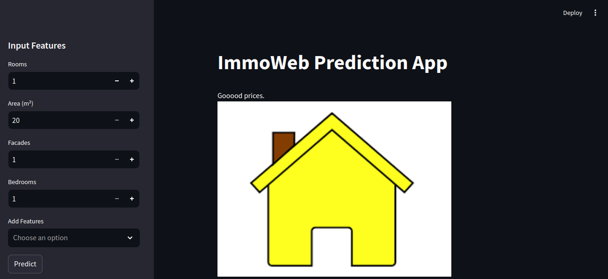

# ImmoApp Prediction Project

## Project Context 📝

This project aims to create a machine learning model to predict the selling price of houses in Belgium. The project includes data scraping, data analysis, model building, and deployment using Streamlit for an interactive user interface.

## Table of Contents
- [Usage](#usage)
- [Streamlit](#streamlit)
- [Model](#model)
- [File Structure](#file-structure)
- [Timeline](#timeline)

## Usage 🛠





### Streamlit 🖱️

The Streamlit application provides an interactive user interface to input features and predict house prices based on a pre-trained Random Forest model.

#### How to Run the App

1. **Run the Streamlit App:**

   ```sh
   streamlit run house_streamlit.py
   ```

2. **Interact with the App:**
   Open your browser and navigate to the local Streamlit server (usually `http://localhost:8501`). Use the sidebar to input the house features and get the predicted price.

## Model 🤖

The model used in this project is a Random Forest Regressor, which was chosen for its accuracy and robustness in predicting house prices. The model was trained on a dataset scraped from Immoweb, a real estate website.

### Features Used

- **Static Features:** `RoomCount`, `LivingArea`, `NumberOfFacades`, `BedroomCount`
- **Optional Features:** `BathroomCount`, `ConstructionYear`, `Fireplace`, `Furnished`, `Garden`, `GardenArea`, `Kitchen`, `Locality`, `MonthlyCharges`, `PEB`, `PostalCode`, `ShowerCount`, `StateOfBuilding`, `SwimmingPool`, `Terrace`, `Toilet`, `TypeOfProperty`, `FloodingZone_Numerical`

The model's input features are dynamically selected based on user input from the Streamlit interface. The features are then mapped and processed before being fed into the model for prediction.

## File Structure 🗃️

```IMMOAPP

  - feature_mappings.py
│ - immapp.py
│ - immologo.png
│ - random_forest_model.pkl
│ - README.md
└
```

- **`img`**: Contains images used in the Streamlit app.
- **`models`**: Directory containing the pre-trained Random Forest model.
- **`streamlit`**: Directory with Streamlit application code and requirements file.
- **`house_streamlit.py`**: Main Streamlit application file.
- **`feature_mappings.py`**: Contains mappings for categorical features.
- **`requirements.txt`**: List of dependencies required for the Streamlit app.

## Timeline 📅

The project was completed over several days, involving the following stages:

1. **Day 1-2:** Data scraping from Immoweb and initial data cleaning.
2. **Day 3:** Data analysis and feature engineering.
3. **Day 4:** Model training and evaluation.
4. **Day 5:** Deployment using Streamlit and final testing.

This timeline ensured a structured and efficient approach to developing and deploying the house price prediction model.

Feel free to explore and use the ImmoApp Prediction project to estimate house prices in Belgium accurately. Enjoy predicting!